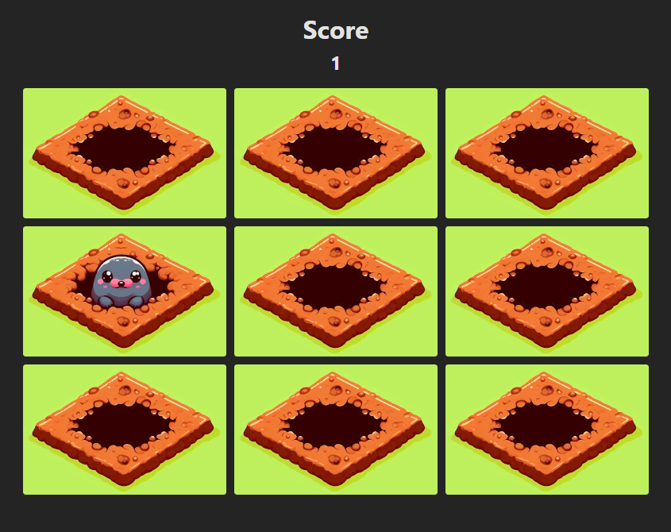

# Challenge: Whack-a-Mole Game

<p align="center">
  
</p>

This challenge involves creating a simple game called "Whack-a-Mole" using any programming language or framework of your choice. 

In the game, players must "whack" or click on moles that appear randomly in a grid. For each mole successfully whacked, the player earns a point. 

## Instructions

Follow the instructions below to complete the challenge:

1. **Set up your project**: Start a new project in your preferred programming language or framework, or use an existing one as a base.

2. **Implement the game**: Create a grid with holes and moles. Moles should appear and disappear randomly in the grid.

3. **Manage game logic**: Implement the game's logic to allow players to "whack" a mole by clicking on it. For each whacked mole, increase the player's score by 1 point.

4. **Style and UI enhancements**: Apply CSS styles to make the game visually appealing. Customize the styles according to your preferences.

5. **Document your code**: Ensure that your code is well-documented so that other developers can easily understand it.

## Go for More

You can take the game further by adding features of your choice such as a start menu, sounds or difficulties.

Add a checklist to this README with the features you added.

## Running the Game

1. Clone this repository or download the files to your computer.

2. Open the project folder in your code editor.

3. Install project dependencies if necessary:

```bash
pnpm install
```

4. Start de proyect:

```bash
pnpm dev
```

5. Open your web browser and go to [localhost:5173](http://localhost:5173/)